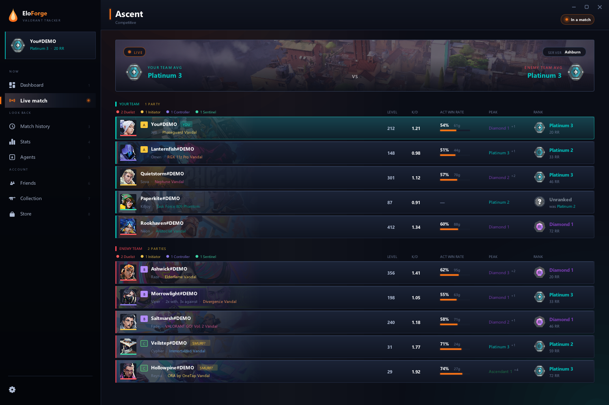
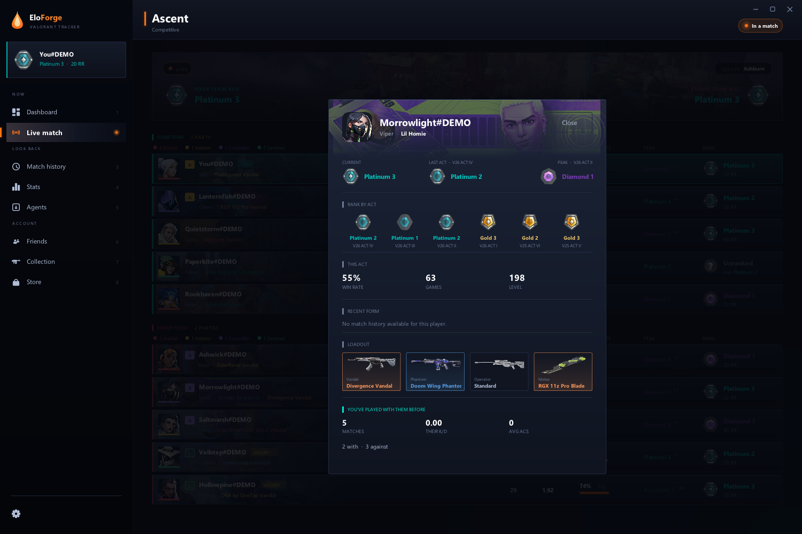
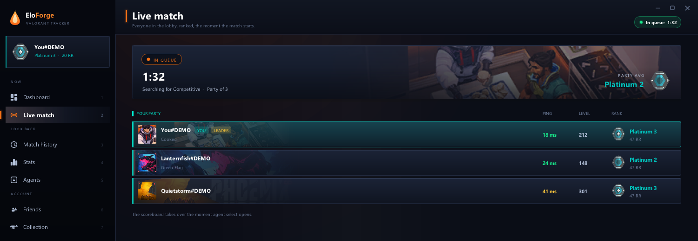
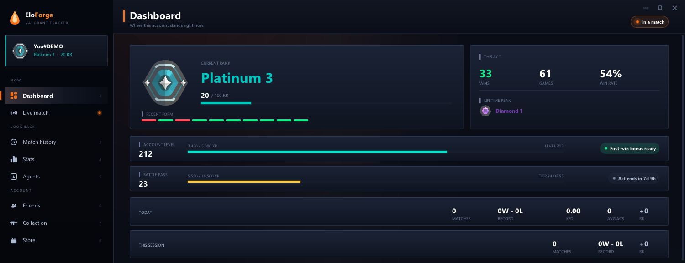
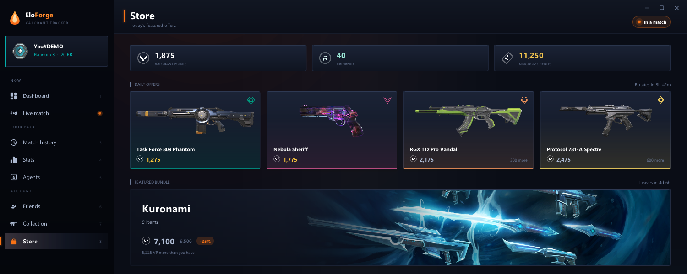

# EloForge

A VALORANT tracker for Windows. From the moment agent select opens, it shows everyone's rank, peak, win rate, K/D, skins and who queued together, and it keeps a history of every match you play.

It reads the local API the Riot Client already runs on your own machine. **Nothing is injected into the game**: no memory reads, no DLLs, no overlay, no simulated input. See [How it works](#how-it-works).

**[Download the latest release](https://github.com/syczDev/eloforge/releases/latest)**



---

## What it does

**Live match.** Everyone's current rank, peak rank, act win rate, K/D and account level, from agent select on, and the enemy team as soon as the match loads. Each row carries the player's card art. Immortal and Radiant players show their leaderboard position. A player who has not ranked this act yet shows where they finished the last one, so "Unranked" stops hiding a Diamond. Above the board are both teams' average ranks and the server the match is on.

**Who queued together.** Shown on both teams during the match, not afterwards. Each party gets a letter and a colour. A party Riot is reporting live gets a solid badge. A pair EloForge has seen queue together in recent matches gets an outlined badge that explains itself when you hover it.

**Skins.** Every player's Vandal or Phantom on their row, in the colour of its edition.

**Player cards.** Click anyone on the scoreboard to see their title, current, last-act and peak rank, where they finished each of their last six acts, their recent form, your history with them and their Vandal, Phantom, Operator and knife.



**Your lobby.** In the menus, the Live page shows your party: each member's rank, level, title and ping, who is leading, and a timer while you queue. The timer also runs in the header on every page.



**Dashboard.** Your rank and RR, this act's record, your lifetime peak, recent form, account level and XP, whether today's first-win bonus is still available, and your battle pass tier with how long the act has left. It warns you if Riot has a matchmaking penalty on the account.

**Match history and stats.** Your last games with score, K/D/A, combat score, headshot percentage and the RR each one won or lost. Click any match for the full scoreboard with a round-by-round timeline. Stats break down win rate by agent and map, attack against defence, and how your combat score is trending. Everything is saved on your PC, so your history keeps growing past what Riot keeps.

**Encounters.** "2 with · 3 against" next to anyone you have played with before.

**Store.** Your VP, Radianite and Kingdom Credits, today's offers in their edition colours with what you would be short by, the night market when it is on, and the featured bundle with its price and saving.

**Collection.** Every skin you own, by weapon, with its levels and colour variants. Equip one and it is on your gun next match.

**Friends.** Who is online, their rank, and what they are doing: in a match, on which map and in which queue.

| Dashboard | Store |
|---|---|
|  |  |

---

## Install

You need **Windows 10 or 11**. Nothing else: no .NET, no Visual C++ redistributable, no API key.

Get one of these from [Releases](https://github.com/syczDev/eloforge/releases/latest):

- **`EloForge-Setup.msi`** installs to `%LOCALAPPDATA%\Programs\EloForge`, adds a Start menu entry, and updates itself. This is the one to use.
- **`EloForge.exe`** is the same app as a single file. Put it anywhere and run it. It updates itself too.

Start the Riot Client and EloForge picks up everything else. It does not have to be opened before the game, and it follows you if you sign in to a different account.

Windows SmartScreen may warn you the first time, because the app is not code-signed. Click **More info**, then **Run anyway**.

---

## How it works

While it is running, the Riot Client hosts a small HTTPS server on `127.0.0.1` for its own interface to use. It writes the port and a password to a lockfile:

```
%LOCALAPPDATA%\Riot Games\Riot Client\Config\lockfile
```

EloForge reads that file, signs in with those details, and asks for the same information the game already shows you:

1. **The local client API** (`127.0.0.1`) hands over a session token and your presence, which says whether you are in the menus, agent select or a match.
2. **The game's own web services** answer with the match roster, ranks, loadouts and history, using that token.

```
Riot Client ──lockfile──> EloForge ──presence──> what state am I in?
                             │
                             └──token──> Riot's game services ──> roster, ranks, history
```

Game art, maps and rank icons come from [valorant-api.com](https://valorant-api.com).

### What it changes: skins and insta-lock

Almost everything in EloForge only reads. Two features change something, and only when you ask:

**Equipping a skin** from the Collection page saves your loadout with the same request the game's own Collection screen sends. It only changes your own cosmetics. It is still an outside app changing your account, so use it only if you're comfortable with that.

**Insta-lock** locks an agent for you in agent select. That is automation, it is against Riot's Terms of Service, and it can get your account banned.

There is no setting that arms it in advance and no way to leave it running. It takes three deliberate steps, and does nothing if you skip any of them:

1. When agent select opens, a prompt asks whether you want to insta-lock. Say no and nothing happens.
2. Say yes and you get a grid of the agents you own. Clicking one only selects it.
3. A confirmation names the agent and repeats the ban risk. Only this last button sends anything to the game.

Use it knowing the risk.

### On safety

Apart from those two, EloForge only reads, and it always stays outside the game process. The things that actually get people banned (reading game memory, injecting a DLL, drawing an overlay into the game, automating input) are exactly what it does not do. It is still unofficial, and Riot has never promised these endpoints will keep working, so treat it accordingly.

It also respects incognito. If a player has hidden their name in game, EloForge shows them the way the game does, and does not show their card or title either.

---

## Privacy

**Everything about your matches stays on your PC.** Your match archive, settings, cached artwork and log all live in `%LOCALAPPDATA%\EloForge\` and are never uploaded anywhere. The only other places the app talks to are valorant-api.com for game art and GitHub to check for updates, and neither is sent anything about you.

**One thing does leave your PC.** When EloForge starts, it reports the launch to a Discord webhook the author reads, to see how many people use it. It sends:

| Field | What it is |
|---|---|
| Install | A random id made the first time the app runs. It identifies the install, not you. |
| Version | Which version you are running. |
| Launch | How many times this install has been started. |
| Region | Your game region, e.g. `NA`. |
| Rank | Your current rank name, e.g. `Gold 2`. |
| Archive | How many matches you have saved. |
| Windows | Your Windows build number. |
| Client | `x64` and your CPU core count. |

**Your Riot ID is not included** unless you turn on *Share my Riot ID* in Settings → Privacy. It is off by default.

**To turn the report off completely**, uncheck *Share anonymous usage* in Settings → Privacy. It is sent once at start-up, so the change applies from your next launch.

The webhook address is a plain string inside the exe. Anyone with the file can find it, which cuts both ways: the reporting is not hidden, and the address is not a secret.

---

## Troubleshooting

- **Nothing shows up.** The Riot Client has to be running and signed in. EloForge connects by itself within a few seconds.
- **Ranks or players look wrong.** Make sure you are on the latest version. The app updates itself when it starts, and the banner at the top says when an update is ready.
- **Anything else.** Open an issue and attach `%LOCALAPPDATA%\EloForge\eloforge.log`. It records which account was connected, so skim it before you post it.

---

## Limitations

- **The Riot Client has to be running.** The sign-in comes from it, so with the client closed there is nothing to read.
- **Agent select only shows your team.** Riot does not send the enemy roster until the match begins, so enemy ranks, parties and skins appear when the match loads.
- **Windows only**, because that is where the game is.

---

## Built with

C++ with [Dear ImGui](https://github.com/ocornut/imgui) and Direct3D 11, [SQLite](https://sqlite.org), [nlohmann/json](https://github.com/nlohmann/json), [stb_image](https://github.com/nothings/stb), and game content from [valorant-api.com](https://valorant-api.com).

## License

MIT. See [LICENSE](LICENSE).

---

EloForge is not endorsed by Riot Games and does not reflect the views or opinions of Riot Games or anyone officially involved in producing or managing Riot Games properties. Riot Games and all associated properties are trademarks or registered trademarks of Riot Games, Inc.
