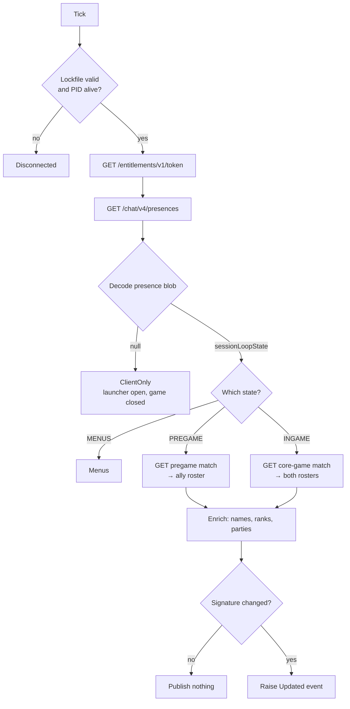

# How EloForge works

A full walkthrough: the stack, the three APIs it talks to, how authentication works, how the poll loop decides what to fetch, and how the UI is put together.

---

## 1. The stack

| Piece | Choice | Why |
|---|---|---|
| Language | **C# 13** | Records, pattern matching, and nullable reference types do a lot of work here. |
| Runtime | **.NET 9** (`net9.0-windows`) | Current LTS-adjacent release; the WPF-UI library targets it directly. |
| UI framework | **WPF** | Native Windows desktop. Retained-mode, XAML-driven, and it ships in the runtime. |
| UI theming | **WPF-UI 4.3.0** | Fluent design controls, Mica backdrop, dark theme, custom title bar. |
| MVVM | **CommunityToolkit.Mvvm 8.4.2** | Source generators turn fields into observable properties and methods into commands, which removes most MVVM boilerplate. |
| JSON | **System.Text.Json** | Built in, fast, and attribute-driven. |
| HTTP | **HttpClient** | Built in. Three separate instances, each with its own certificate and timeout policy. |

**Three dependencies total** (two packages plus the framework). No DI container, no logging framework, no ORM. For an app this size, an explicit object graph is easier to follow than a container.

---

## 2. Project layout

```
src/EloForge/
├── App.xaml(.cs)          Startup, theme, composition root, crash handler
├── app.manifest           Per-monitor DPI awareness
├── assets/eloforge.ico     Generated by tools/make-icon.ps1
├── Models/
│   ├── LocalApiModels.cs  Lockfile, entitlements, presence
│   ├── GameApiModels.cs   Pregame, core-game, MMR, match history
│   ├── ContentModels.cs   valorant-api.com DTOs
│   └── Domain.cs          The app's own types (LivePlayer, MatchSummary, GameState)
├── Services/              All logic. No UI types referenced here.
├── ViewModels/            One per page, plus the shell
├── Views/                 XAML + trivial code-behind
├── Converters/            Value converters for binding
└── Themes/EloForge.xaml    Palette, control styles, converter registrations
```

The rule: **Services never reference WPF types, Views never contain logic.** ViewModels are the only bridge.

---

## 3. The three APIs

EloForge talks to three completely separate systems. Understanding which is which is most of understanding the app.

### 3.1 The Riot Client local API — `https://127.0.0.1:{port}`

While the Riot Client runs, it hosts a small HTTPS server on loopback for its own interface. It writes the connection details to:

```
%LOCALAPPDATA%\Riot Games\Riot Client\Config\lockfile
```

One line, colon-delimited:

```
Riot Client:17348:50006:kK3nR9xQ7vB2mZ:https
    name    : pid : port:   password   :protocol
```

Authenticate with HTTP Basic, username literally `riot`, password from the lockfile.

| Endpoint | Returns |
|---|---|
| `GET /entitlements/v1/token` | `accessToken` (JWT), `token` (entitlement JWT), `subject` (your PUUID) |
| `GET /chat/v1/session` | Riot ID, region, login state |
| `GET /chat/v4/presences` | You and your friends, including a base64 blob per player |

The presence blob is the key to everything. Base64-decode it and you get:

```json
{
  "sessionLoopState": "INGAME",
  "partySize": 2,
  "queueId": "competitive",
  "competitiveTier": 17,
  "accountLevel": 214,
  "matchMap": "/Game/Maps/Ascent/Ascent"
}
```

`sessionLoopState` is `MENUS`, `PREGAME`, or `INGAME`. That one field drives the whole poll loop.

**Two traps, both handled in `LockfileReader`:**

1. Riot holds an open handle on the lockfile, so it must be opened with `FileShare.ReadWrite` or every read throws `IOException`.
2. On an unclean exit the lockfile is **left behind pointing at a dead process**. Checking the file exists is not enough — the recorded PID has to be verified alive, or the app spends its life connecting to a closed port. (This was discovered the hard way; the lockfile on the dev machine was two days stale.)

### 3.2 The game web APIs — `pd` and `glz`

These are the real servers, not localhost. They take the tokens from step 3.1.

- **`pd.{shard}.a.pvp.net`** — player data: rank, match history, names
- **`glz-{region}-1.{shard}.a.pvp.net`** — game state: agent select, live match

Every request needs four headers:

```http
Authorization: Bearer {accessToken}
X-Riot-Entitlements-JWT: {entitlementToken}
X-Riot-ClientPlatform: {base64 platform descriptor}
X-Riot-ClientVersion: release-13.02-shipping-17-5277781
```

The client version has to be current or requests get rejected — EloForge pulls it from valorant-api.com rather than hardcoding it, so it survives patches.

| Endpoint | Purpose |
|---|---|
| `GET {glz}/pregame/v1/players/{puuid}` | Am I in agent select? 404 if not. |
| `GET {glz}/pregame/v1/matches/{id}` | Agent select roster (your team only) |
| `GET {glz}/core-game/v1/players/{puuid}` | Am I in a match? 404 if not. |
| `GET {glz}/core-game/v1/matches/{id}` | Live roster, both teams |
| `GET {glz}/parties/v1/players/{puuid}` | Party ID, for grouping premades |
| `GET {pd}/mmr/v1/players/{puuid}` | Rank, RR, wins, per-tier win counts |
| `GET {pd}/mmr/v1/players/{puuid}/competitiveupdates` | RR gained/lost per match |
| `GET {pd}/match-history/v1/history/{puuid}` | Recent match IDs |
| `GET {pd}/match-details/v1/matches/{id}` | Full scoreboard for one match |
| `PUT {pd}/name-service/v2/players` | PUUIDs → Riot IDs (a lookup, despite the verb) |

**404 is a normal answer**, not an error — it is how the API says "you're not in agent select right now." `RiotRemoteClient.SendAsync` treats it as `null` rather than throwing.

**Region vs shard are not the same thing.** `latam` and `br` are separate regions that both live on the `na` shard, so the URLs need both values. Region comes from Riot's PAS service, which replies with a JWT whose payload holds `affinities.live`. If that fails, it falls back to the chat session's region, then to a manual override in Settings.

### 3.3 valorant-api.com — game content

Community-run, no key, no auth. Supplies everything cosmetic:

| Endpoint | Used for |
|---|---|
| `/v1/agents?isPlayableCharacter=true` | Agent names and portraits |
| `/v1/maps` | Map names, icons, splash art |
| `/v1/competitivetiers` | Rank names, icons, tier colours |
| `/v1/version` | The `X-Riot-ClientVersion` string above |

The game APIs return raw UUIDs and internal paths — `add6443a-41bd-…` for an agent, `/Game/Maps/Ascent/Ascent` for a map. This service is what turns those into "Jett" and "Ascent" plus artwork.

Responses are cached to `%LOCALAPPDATA%\EloForge\content\`, so a cold start with no network still renders correctly. Content only changes on patch day.

> **Three different JSON casings.** Riot is not consistent: pregame/core-game/MMR use `PascalCase`, match-details uses `camelCase`, and the local chat API uses `snake_case`. Every DTO therefore carries explicit `[JsonPropertyName]` attributes rather than relying on a naming policy.

---

## 4. Startup sequence

```
App.OnStartup
  ├─ parse --demo / --page=
  ├─ apply dark Fluent theme + Mica
  ├─ new AppServices(demoMode)      ← builds the whole service graph
  ├─ new MainViewModel(services)     ← builds the four page view models
  └─ window.Show()                   ← UI paints immediately

MainWindow.Loaded (async)
  └─ MainViewModel.InitializeAsync
       ├─ ContentService.InitializeAsync   ← download agents/maps/tiers
       ├─ LiveMatchService.Start()          ← begin polling
       └─ DashboardViewModel.RefreshAsync
```

Content loading happens **after** the window is shown, so the app paints instantly instead of blocking on the network. The `_isInitialized` flag prevents pages from rendering before agent and map lookups exist — without it, navigating straight to History produced rows with blank icons and fallback map names.

---

## 5. The poll loop

`LiveMatchService` is the engine. Every 3 seconds (configurable, floor of 2):



Two design decisions worth calling out:

**Presence is the cheap gate.** Asking "what state am I in" costs one localhost request. Only when the answer justifies it does the app touch the heavier remote endpoints. In menus, that's the only request made.

**Change detection by signature.** Each snapshot is reduced to a string of `puuid:agent:locked:tier:name` per player. If it matches the previous tick, no event fires. Without this the scoreboard would rebuild its rows every 3 seconds, destroying scroll position and flickering. With it, an update fires exactly when someone locks an agent or a rank resolves.

### Caching

`PlayerInfoService` fronts rank lookups with a **10-minute TTL cache**. A live scoreboard has 10 players and polls every 3 seconds — uncached, that would be 200 MMR requests per minute for data that cannot change mid-match. Requests for uncached players run at a concurrency of 3 to stay polite.

Party lookups are cached per match ID, since party composition is fixed once a match starts.

---

## 6. The UI layer

### MVVM with source generators

```csharp
[ObservableProperty]
[NotifyPropertyChangedFor(nameof(ShowScoreboard))]
private GameState _state = GameState.Disconnected;
```

The toolkit generates a public `State` property that raises `PropertyChanged` for itself *and* for the computed `ShowScoreboard`. Similarly `[RelayCommand]` on a method generates an `ICommand` the XAML binds to. This removes the several hundred lines of boilerplate classic MVVM demands.

### Navigation

There is no navigation framework. `MainViewModel.CurrentPage` holds a view model instance, and a `ContentControl` renders it through implicit data templates:

```xml
<DataTemplate DataType="{x:Type vm:LiveMatchViewModel}">
    <views:LiveMatchView />
</DataTemplate>
```

WPF matches the type and instantiates the right view. The sidebar's `RadioButton`s bind `IsChecked` **one-way** to `IsLiveSelected` and friends, so that programmatic navigation — jumping to the live page when agent select opens — moves the highlight too, not just the content.

### Theming

`Themes/EloForge.xaml` holds the entire design system: a palette of colour and brush resources, typography styles, and templated control styles. Views reference `{StaticResource AccentBrush}` and never a literal colour, so the palette is changeable in one place.

Rank tier colours are the exception — they come from the API per tier and are applied through `StringToBrushConverter`, which parses the hex and caches frozen brushes.

### Converters

Binding-time transforms live in `Converters/Converters.cs`: outcome → brush/text, RR → signed string with colour, timestamps → "3h ago", locked state → row opacity, bool/null → visibility. Keeping these out of the view models means the view models hold data, not presentation.

### Threading

The poll loop runs on a background thread. `ObservableCollection` is not thread-safe and WPF will throw if it is mutated off the UI thread, so every event handler marshals:

```csharp
if (dispatcher is null || dispatcher.CheckAccess())
    Apply(snapshot);
else
    dispatcher.Invoke(() => Apply(snapshot));
```

---

## 7. Failure handling

The guiding rule: **a tracker must never crash because a poll failed.**

- Network calls return `null` on failure rather than throwing; callers treat that as "no data yet".
- `OperationCanceledException` is always rethrown so shutdown is not swallowed.
- A last-resort `DispatcherUnhandledException` handler logs, shows a message, and sets `Handled = true` so the window survives.
- Everything is logged to `%LOCALAPPDATA%\EloForge\eloforge.log`, with PUUIDs redacted from URLs.

Four distinct states get four distinct explanations in the UI, rather than one generic error: client offline, game not running, in menus, and in a match.

---

## 8. Demo mode

`--demo` swaps every data source for `DemoData`, which builds a plausible match and history using real agents and maps from the content API but entirely invented players. It exists so the UI can be developed without sitting in a real game, and so README screenshots never publish real players' names and ranks.

`--page=live|dashboard|history|settings` opens straight onto a page, which makes scripted screenshots reproducible.

---

## 9. Build and packaging

```bash
dotnet build EloForge.sln -c Release          # needs .NET runtime installed
tools/publish.ps1                            # single 59 MB self-contained .exe
tools/publish.ps1 -Mode Framework            # single 2 MB .exe, runtime required
```

The standalone build sets `PublishSingleFile`, `SelfContained`, `IncludeNativeLibrariesForSelfExtract` (WPF has native components that must be packed), and `EnableCompressionInSingleFile` (roughly halves the size).

**Trimming is deliberately off.** WPF resolves types through XAML by reflection, which the trimmer cannot see; a trimmed build compiles and then fails at runtime. That is why the file is 59 MB and not 15.

`tools/make-icon.ps1` generates the app icon in code, drawing each size natively rather than downscaling one bitmap. It writes classic DIB entries rather than PNG-in-ICO — the latter is valid and Explorer reads it, but GDI+ cannot, which breaks `System.Drawing.Icon` and anything built on it.

`tools/screenshot.ps1` captures the window with `PrintWindow(PW_RENDERFULLCONTENT)` rather than a screen-region grab, so it captures the app and nothing else that happens to be on screen.

---

## 10. Known limits

- The Riot Client must be running; the tokens come from it.
- Agent select shows your team only — Riot does not transmit the enemy roster until the match starts.
- Party grouping is best-effort; not every lobby's party data is readable.
- These endpoints are undocumented and unofficial. Riot has never promised they will keep working, and a patch can change them without warning.
